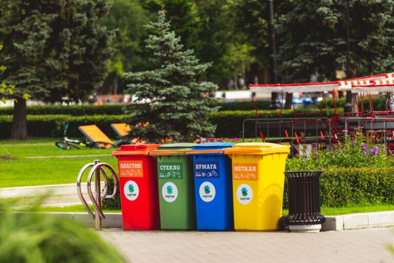

# Garantizar 
## Descripcion 
Algunas de las acciones que podemos llevar a cabo para garantizar la protección del medio ambiente son: 
- Reciclar
- Ahorrar agua de la cisterna
- Apoyar a las energías renovables
- Evitar el consumismo, especialmente de ropa
- Reducir el consumo de carne
- Usar las papeleras y contenedores
- Usar envases biodegradables
## Foto

