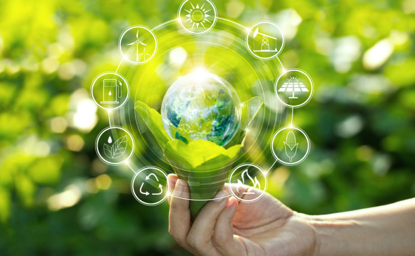

# Objetivos

Los principales objetivos son conservar y, si es posible, reparar la biodiversidad y medio ambiente controlando y corrigiendo las nuevas actividades que causan daños y contaminen a la naturaleza. 
Busca desarrollar nuevas acciones más efectivas para la conservación del planeta.

## Algunos Objetivos
- Prevenir degradaciones.
- Corregir actuaciones degradantes.
- Curar degradaciones: recuperar, restaurar, reformar y rehabilitar.
- Mejorar situaciones que puedan ser mejorables.
- Poner en valor los recursos de los que se dispone.

